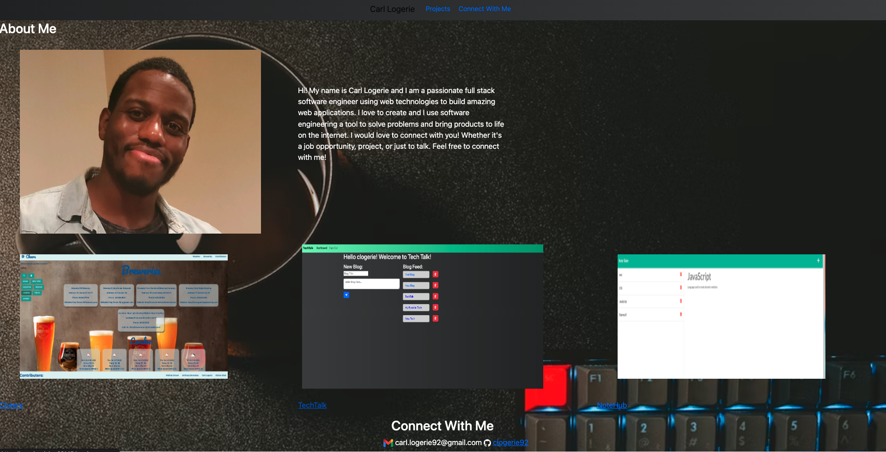

# MyPortfolio

## Table of Contents
* [Description](#description)
* [Preview](#preview)
* [Contact](#contact)

## Description

I created a portfolio website to showcase my skills and projects that I've contributed to during Rutgers Coding Bootcamp. More projects will be added to this site as I progress through the bootcamp.

## Preview

The following image shows a mock-up of my portfolio website.

 
GitHub Pages - https://clogerie92.github.io/MyPortfolio/  

## Contact
Please contact me at carl.logerie92@gmail.com with any questions.